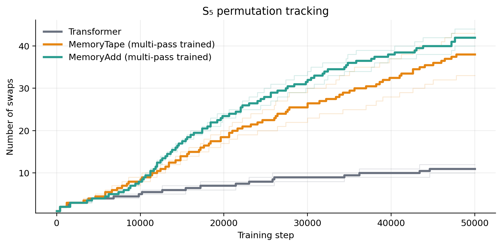
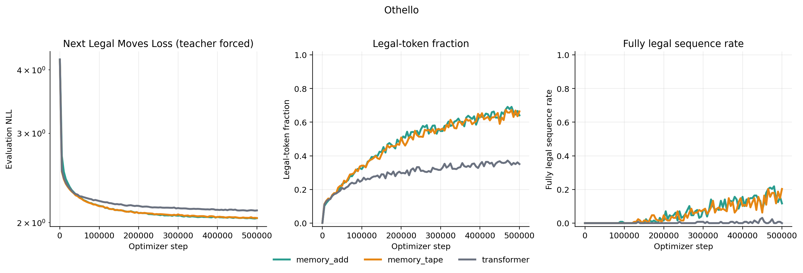

# Multi-Pass Transformer Training

This project explores a way to train transformers for recurrent-style inference without training them as token time recurrent models. The key idea is to train transformers with multiple passes over the same token-sequence. Earlier passes write per-token memory states; later passes read shifted versions of those memories, giving each token access to deep-layer information from previous token positions while preserving parallel training.

> **Project status (August 2026).** On August 9, 2026, Wang et al. published
> [*Full-bandwidth transformer*](https://arxiv.org/abs/2608.08888). The paper
> independently develops the central multi-pass latent-feedback idea explored
> here and validates it at much larger scale. It has stronger benchmarks and a
> fuller analysis. If this repository interests you, read their paper first. 
> I am glad to see the idea work in the big leagues. This repository remains 
> a small testbed for explicit memory-tape variants and controlled state-tracking 
> experiments.

## A Motivating Problem: State Tracking

Transformers often struggle with algorithmic state tracking (see, for example, [Li25](https://arxiv.org/abs/2503.02854)), which is why related tasks appear in challenging benchmarks such as BBH (see [Suzgun22](https://arxiv.org/abs/2210.09261)). Transformers have difficulties tracking an increasing number of sequential state changes. The $S_5$ permutation task, for example, looks like "[A,B,C,D,E] swap 1 2 [B,A,C,D,E]".



In my implementation models predict only the final state and the number of swaps is increased once validation accuracy exceeds 95%. For these experiments, the baseline transformer and multi-pass models use the `small` preset: 4 layers, 4 attention heads, and 128 embedding dimensions. The baseline is intentionally depth-constrained, while the multi-pass models can reuse a shifted memory tape across recurrent passes. The baseline's learned number of state changes therefore flattens in a way that multi-pass training alleviates.

## A Theoretical Motivation

The training-time parallelization of decoder-only transformers is one of the main reasons they scale so well. At layer $l$, the hidden state $h_i^l$ at position $i$ can attend to positions $h_{j\leq i}^{l-1}$ from layer $l-1$, and not to hidden states from the same or deeper layers. This *causal* attention pattern permits hidden states for all token positions in a layer $[h_{1}^{l}, \ldots, h_{n}^l]$ to be computed in parallel during training, but it also disallows attention to previous tokens' deeper-layer hidden states at inference time.

This information flow gives the model no learned latent state independent of the token prefix. Without a KV cache, each generation step recomputes the prefix. A KV cache is runtime state that avoids this repeated computation, but it is functionally determined by the token prefix and does not carry information that a full-prefix evaluation would not reconstruct.


The tempting 'fix' would be to let the hidden state $h_{i}^{l}$ at token $i$ depend directly on the hidden state $h_{j}^{\ell}$ at token $j<i$ in the same or deeper layers $\ell \geq l$. But that would introduce a token-time recurrence: position $i$ would have to wait for position $i-1$, and the training-time parallelism would be lost.


But here is an idea: what if we run multiple sequential passes over the same teacher-forced sequence instead of making token $i$ wait for token $i-1$ during training? Token positions remain parallel within each pass, while the passes themselves form a recurrence. Pass 1 writes a memory tape. Pass 2 reads a shifted version of that tape. Pass 3 can read the shifted tape from pass 2, and so on. The hope is that such multi-pass training can teach the model to emit memories that are useful and stable enough to support cheaper recurrent-style memory use at inference time.

### Setup

The goal is to train the model to read and write a memory state for each token, and then test whether those memories can be reused during generation. There are many possible memory designs. This project focuses on one memory vector per token per pass.

For a token sequence $T = [t_0, \ldots, t_{n-1}]$, let $M^{(k)}$ be the length $n$ memory tape written after pass $k$. The all-zero tape is the initial state $M^{(0)} = 0$, and the multi-pass recurrence is:

```math
(L^{(k)}, M^{(k)})
= F_\theta\left(T, \mathrm{Shift}(M^{(k-1)})\right),
\qquad k = 1, \ldots, K
```

Here $L^{(k)}$ is the pass $k$ logit tensor. $F_\theta$ is schematic: an architecture may write memory from any internal representation, not necessarily its final hidden state. The causal constraint is that position $t$ may read only memories written at earlier positions. In a parallel batch, that is implemented by a one-position shift:

```math
\mathrm{Shift}(M)[0] = 0
\qquad
\mathrm{Shift}(M)[t] = M[t - 1]
\quad \text{for } 1 \le t < n
```

That keeps the training computation parallel over token positions while giving each pass access to information written by the previous pass.

## Multi-pass Training

Multi-pass training runs the same teacher-forced sequence through the model several times. Crucially, recurrence is over the pass dimension, not over token time; within each forward pass, all token positions are still computed in parallel, as in the forward pass of an ordinary transformer.

Perhaps the easiest way to illustrate this is to imagine using a transformed last-layer hidden state as the memory. That memory can be fed back into the next pass in different ways, for example by concatenating it to the input stream or by reading it through a separate causal cross-attention path.


The $K$-pass training loop is:

> $`M^{(0)} = 0`$<br>
> $`\mathcal{L} = 0`$<br>
> $`\textbf{for } k = 1, \ldots, K:`$<br>
> &nbsp;&nbsp; $`R = \mathrm{Shift}(M^{(k-1)})`$<br>
> &nbsp;&nbsp; $`H = \mathrm{ArchitectureDecoder}(T, R)`$<br>
> &nbsp;&nbsp; $`L^{(k)} = \mathrm{LMHead}(H)`$<br>
> &nbsp;&nbsp; $`M^{(k)} = \mathrm{MemoryWriter}(H)`$<br>
> &nbsp;&nbsp; $`\mathcal{L} = \mathcal{L} + w_k\,\mathrm{LMLoss}(L^{(k)}, Y)`$

Most experiments put the heaviest weight on the final pass. The final pass is therefore trained to do the main predictive work, while earlier passes are encouraged to write memories that make later predictions easier.

The training schema:

1. pass `k` reads the shifted memory tape written by pass `k - 1`
2. pass `k` predicts the same next-token targets as the other passes
3. pass `k` writes a new memory tape for pass `k + 1`

is exact with respect to this `K`-pass model. No approximation has been introduced yet.

## Mismatch and Append-Recurrent Inference

And how do we get stateful inference out of this? Well, the exact inference procedure for this model is expensive. For every new token, we can run all $K$ passes on the full current prefix. That exact `recompute` procedure preserves the same pass-by-pass recurrence used in training, but it is too expensive for the target inference mode. What we want is append-recurrent inference:

1. Run the prompt exactly for $K$ passes.
2. Cache the final prompt memory tape $M_{\mathrm{prompt}}^{(K)}$.
3. Generate the first token from the final prompt logits.
4. Run one pass over the extended prefix using the persistent memory cache.
5. Append only the memory written for the newest token.
6. Repeat without rewriting the older cached memories.


The first generated token is special. After the $K$ prompt passes, the model already has both the final logits for predicting the next token and the final prompt tape $M_{\mathrm{prompt}}^{(K)}$. So no extra recurrent pass is needed to sample the first token. Once $t_{n+1}$ has been generated, the model runs one pass over the extended prefix while reading the persistent prompt tape. It keeps the old entries fixed and appends the newly written memory for the generated token:

```math
\mathrm{Append}\left(M_{\mathrm{prompt}}^{(K)}, \widetilde M_{\mathrm{new}}\right)
```

The next generated token is then produced from a tape containing both final-pass prompt memories and a memory written by the online recurrent procedure. Each following step appends one more such memory. That is the approximation. Exact recomputation would rerun all $K$ passes on the longer prefix. Causality means that the prompt positions would be reconstructed identically, but the new position would be processed through the full sequence of $K$ pass updates. Append-recurrent inference reuses the final prompt tape and gives the new position only one online recurrent update before appending its memory. The project therefore depends on a stability question:

> Does multi-pass training produce final-pass memories that remain useful when they are frozen and extended recurrently with newly generated memories?

If yes, generation can pay for the $K$-pass computation once on the prompt and then continue with one pass per generated token. If no, the recurrent tape drifts away from the finite-pass model. The real empirical question is the gap between `recompute` and `append_recurrent` generation, especially as the generated suffix becomes longer.

## Experiments

### Long-Range Trace Tasks

Okay, but the state-tracking tasks introduced earlier had only a few tokens to predict. Is this not a cherry-picked set of tasks that avoids the mismatch problem?

Yes, partly. The BBH curriculum tasks isolate whether the model can learn repeated state updates without trace supervision, but final-answer-only supervision does not stress test append-recurrent generation over a long suffix. The mismatch problem only becomes unavoidable when the model has to keep generating after the prompt and repeatedly feed its own recurrent memory cache forward.

That is why the repo also includes longer-range trace tasks. These are fixed-trace generation problems where the model must emit a long legal suffix after the prompt, so `recompute` versus `append_recurrent` evaluation becomes a real test of recurrent stability. One motivation is the world model studied in [OthelloGPT](https://arxiv.org/pdf/2309.00941), an eight-layer GPT-2-style model trained to predict legal sequences of [Othello](https://www.eothello.com/) moves. Because move legality depends on the evolving board state, the model must learn an implicit form of board-state tracking. Most Othello games last about 60 moves, making legal continuation a useful long-range state-tracking task.



The plot above comes from an earlier architecture sweep. Some plotted variants are now preserved on the `archived-architectures` branch rather than supported on `main`. The current models still need a matched rerun under both `recompute` and `append_recurrent` before the figure is updated.

## Multi-pass Architectures

`main` supports two multi-pass memory designs. Both use the shared training and inference methods implemented by `MultiPassTransformer`.

The notation in this section is tensor-level: $X$ is the token-embedding stream, $M^{(k)}$ is the full tape written at pass $k$, and $R = \mathrm{Shift}(M^{(k-1)})$ is the tape read at the next pass. The shared wrapper performs the shift, final normalization, language-model head, and memory write. Each model defines only the decoder mapping $(X,R)$ to its pre-final hidden stream.

### Memory Through Attention: The MemoryTape Architecture

MemoryTape retains an ordinary causal token decoder. Its decoder is:

> **MemoryTape decoder**
>
> $`H = X`$<br>
> $`\textbf{for each decoder block:}`$<br>
> &nbsp;&nbsp; $`H = H + \mathrm{CausalSelfAttention}(\mathrm{LN}_{\mathrm{self}}(H))`$<br>
> &nbsp;&nbsp; $`H = H + \mathrm{CausalCrossAttention}\left(Q=\mathrm{LN}_{q}(H),\ KV=\mathrm{LN}_{kv}(R)\right)`$<br>
> &nbsp;&nbsp; $`H = H + \mathrm{MLP}(\mathrm{LN}_{\mathrm{mlp}}(H))`$<br>

Causal cross-attention is applied over $R$ as a separately addressable key/value source; the tape is not concatenated with the token stream. Its inclusive causal mask permits query position $t$ to read tape slots $s\leq t$. Because $R_s=M_{s-1}$, this is strict causality with respect to the unshifted tape: only memories from original positions before $t$ are readable. The reader is an ordinary residual branch with no learned gate. Its output projection is initialized at half the standard residual scale, preserving the former initial memory-read amplitude without introducing a scale-nonidentifiable scalar parameter. On pass one, $R=0$, so the cross-attention contribution is exactly zero and the model begins as a causal token decoder.

### Residual Memory Fusion: The MemoryAdd Architecture

MemoryAdd keeps the ordinary token stream intact and learns a residual correction from the shifted recurrent tape:

> **MemoryAdd decoder**
>
> $`H = X + W_{\mathrm{mem}}\mathrm{LN}_{\mathrm{mem}}(R)`$<br>
> $`\textbf{for each causal decoder block:}`$<br>
> &nbsp;&nbsp; $`H = \mathrm{DecoderBlock}(H)`$<br>

## Tasks

The repository has two task families:

- BBH curriculum tasks predict one final answer. Their difficulty increases after validation accuracy reaches 95%.
- Trace tasks generate a full suffix from a preset-defined distribution. They test long continuations under `recompute` and `append_recurrent` inference.

Task generators and task-specific metrics live under `tasks/`. See [tasks/README.md](tasks/README.md) for the task catalogue, distributions, and evaluation definitions.

## Running experiments

`main` supports `transformer`, `memory_tape`, and `memory_add`. The canonical launchers run preset-defined experiment matrices:

```bash
bash scripts/bbh/run.sh
bash scripts/trace/run.sh
```

Use environment variables to select tasks, architectures, seeds, the device, and the result root:

```bash
DEVICE=mps \
TASKS=shortest_path \
ARCHITECTURES="transformer memory_tape memory_add" \
SEEDS="1337 2027 4099" \
RESULT_ROOT=results/trace \
bash scripts/trace/run.sh
```

Each run writes `config.json`, `metrics.jsonl`, `best.pt`, and `latest.pt`. A run directory contains one training history. Use `--resume-from` to continue that history.

Use `tests/test_smoke.sh` for a quick end-to-end check. Use `tests/test_shortest_path.sh` for the complete shortest-path workflow check.

## Evaluation and diagnostics

Evaluate a trained trace run with its task-specific metrics:

```bash
RUN_DIR=results/trace/shortest_path/main/memory_tape/seed_1337 \
DEVICE=mps \
bash scripts/trace/eval.sh
```

The launcher reads the task and architecture from `config.json`. It evaluates `best.pt` by default. Set `CHECKPOINT=latest` to evaluate the final training state.

Run memory-use and pass-dynamics diagnostics separately:

```bash
python3 -m experiments.diagnose_memory \
  --input-run-dir results/trace/shortest_path/main/memory_tape/seed_1337 \
  --extra-passes 6 \
  --schedule-gap-horizon 16
```

The report includes memory interventions, pass dynamics, schedule gap, and effective rank. Training logs also contain global and component gradient norms.

## Plotting notebooks

The tracked, output-free notebooks under `figures/` read the current artifact schemas directly:

- `01_bbh_curricula.ipynb` plots the $S_5$ permutation frontier and overall BBH curriculum coverage. It does not join loss across difficulty changes.
- `02_trace_learning.ipynb` plots conventional fixed-difficulty learning curves and measured throughput for Othello and shortest path.
- `03_deployment_and_othello.ipynb` compares paired `recompute` and `append_recurrent` quality, per-position free-generation drift, teacher-forced schedule gaps, and Othello random-prefix/legal-set metrics.
- `04_ablation_diagnostics.ipynb` mirrors the merge-decision rules with paired seed deltas, quality–efficiency plots, memory interventions, extra-pass dynamics, and schedule-gap comparisons.

The notebooks do not automatically save or overwrite any tracked figures. Select a comparable result root and uncomment an individual `savefig` line only when a plot is worth keeping. Install the plotting extras and start Jupyter from the repository root:

```bash
python3 -m pip install ".[plot]"
jupyter lab figures/
```

Measured throughput should only be compared across matched devices, batch sizes, task difficulty, evaluation counts, and output-length distributions. The notebooks show individual seeds alongside unsmoothed medians and avoid confidence bands that would overstate what a three-seed ablation establishes.

## Architecture Examples

Baseline transformer:

```bash
python3 -m experiments.train_bbh \
  --preset permutation_main \
  --architecture transformer
```

MemoryTape:

```bash
python3 -m experiments.train_bbh \
  --preset permutation_main \
  --architecture memory_tape
```

MemoryAdd:

```bash
python3 -m experiments.train_bbh \
  --preset permutation_main \
  --architecture memory_add
```

## Requirements

The code is written in Python and PyTorch. The default device is selected automatically: CUDA when available, then MPS, otherwise CPU.

For local development, install the test dependency group if you want to run pytest:

```bash
python3 -m pip install ".[test]"
```

To choose a device explicitly, pass `--device cpu`, `--device mps`, or `--device cuda` to the training scripts.

Local reference PDFs can live under `papers/`; that directory is ignored by git.
